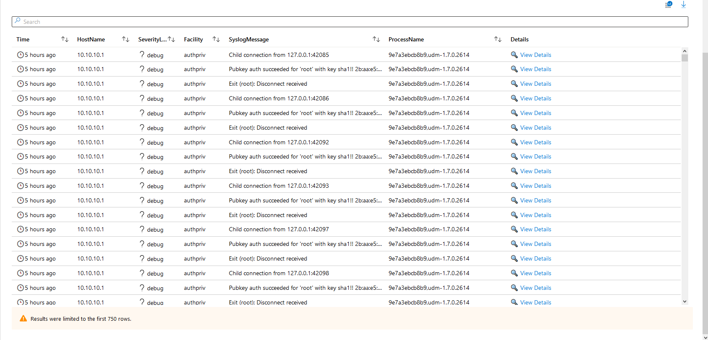
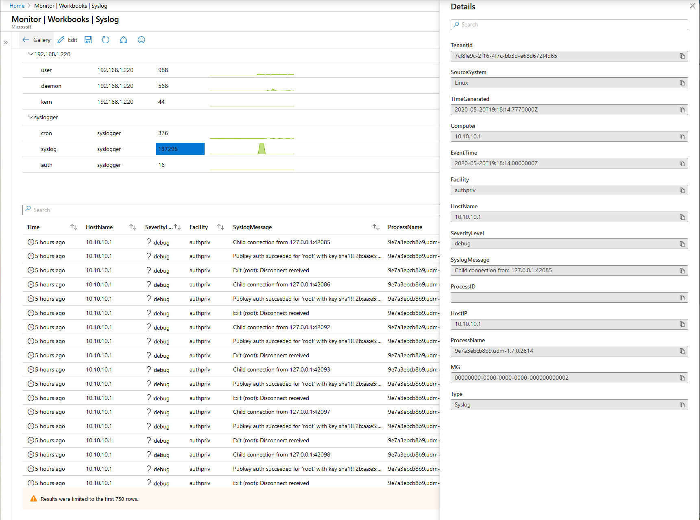

# Azure Sentinel/Monitor Syslog Workbook

## Purpose
Community Syslog workbook mirroring Windows Event Log workbook

### Related blog post
https://www.systemcenterautomation.com/azure-sentinel-syslog-workbook

### Parameters
Workbook is entirely dynamic. Facility and Severity Level paramters rely on HostName parameter, and Severity Level relies on both.

### Images

